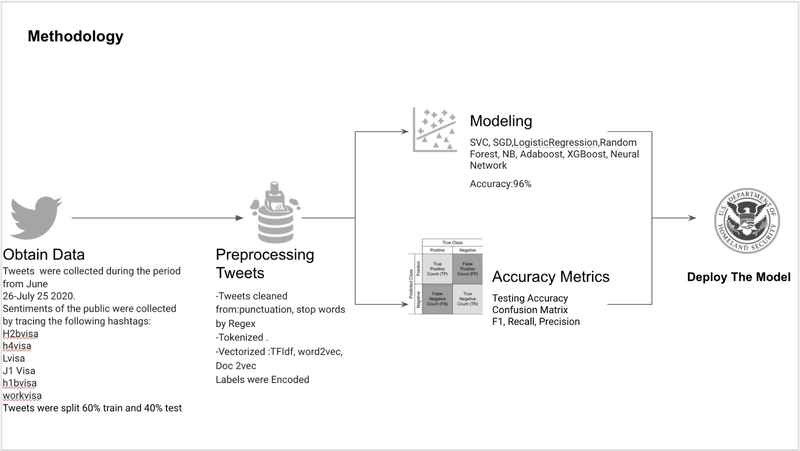

# Twitter Sentiment Analysis on

## Proclamation Suspending Entry of Aliens Who Present a Risk to the U.S. Labor Market Following the Coronavirus Outbreak
 
###  By Khulood Nasher

## Introduction
### Define the Problem

Disease diagnosis with radiology is a common practice in medicine  but requires doctors to interpret the results from the x-ray images. Due to the increase in the number of patients and the low availability of doctors, there was a need for a new method to diagnose .
Fortunately machine learning has introduced the solution for this problem . In this project we are going to introduce deep learning models and techniques in diagnosing pneumonia.
Through this project, we applied deep learning CNN techniques in image classification and we followed the data science methodlogy as follows:

# Obtain Data:

## Preprocessing Images:

* All the images were reshaped to size 150 by 150

* Load image data from the hierarchical file 'chest_xray' using an image datagenerator.

* define testing,training , validation.

* Decode the JPEG content to RGB grids of pixels.

* reshape all images to same size of 150 x 150 pixels

* Convert pixels into floating point tensors

* chuck data by "batch_size=32'

* Rescale the pixel values( between o and 255) to the [0,1] interval.

## About the X-ray images data:
An input of  total x-ray images of 4,704  were  downloaded  from kaggle, 

https://www.kaggle.com/paultimothymooney/chest-xray-pneumonia. 

The data images in  kaggle was not split appropriately, so we split the images  manually  with percentages of :60% train, 20% val, 20% test.

Our image data were as follows:

## Train data:
 
 2480 images belong to 2 classes: Normal and pneumonia.The Normal images in the training set  are 878 images, while the pneumonia images are 1604 images which is 
 
 almost double the number.

## Validation Data:

There are 1102 images belonging to 2 classes:Normal and pneumonia.The Normal images in the training set  are 322 images, while the pneumonia images are 802 images 
which is almost double the number.

## Test data:

There are 1102 images belonging to 2 classes:Normal and pneumonia.The Normal images in the training set  are 321 images, while the pneumonia images are 781 images 
which is almost double the number.

# Methodology:

## Question1: How is an image classification model typically designed?

We can divide this process broadly into 4 steps. Each step requires a certain amount of time to execute: https://www.analyticsvidhya.com/blog/2019/01/build-image-classification-model-10-minutes/

###  Loading and pre-processing Data – 30% time

### Defining Model architecture – 10% time

### Training the model – 50% time

### Estimation of performance – 10% time

Train data - used to make CNN adjust weights(parameters)

Validation Data - used to make CNN adjust hyperparameters. This has to be done manually

Test Data - Final testing of performance
We will need to go back after each iteration, fine-tune my steps, and run it again. Having a solid understanding of the underlying concepts will go a long way in accelerating the entire process.
 
 
### Training the model

For training the model, we require:

Training images and their corresponding true labels, used  CNN deep learning and adjust weights(parameters) through hypertuning parameters such as: Padding,Dropout, 
Elastic Net,Augmentation techniques,Transfer Learning Techniques,VGG16.

Validation images and their corresponding true labels (we use these labels only to validate the model and not during the training phase)

We also define the number of epochs. we ran all the models for 30 epochs.

* How could an individual or organization use my product or findings?
* What will I be able to accomplish in the time I have available?
* What challenges do I foresee with this project?

## Technical Requirements

Your project must meet the following technical requirements:

1. **_No Off-The-Shelf Datasets_**. This project is a chance for you to highlight your critical thinking and data sourcing skills by finding a good dataset to answer a useful question. You _can_ use a pre-existing dataset, but you should consider combining it with other datasets and/or engineering your own features. The goal is to showcase your ability to find and work with data, so just grabbing a squeaky-clean dataset is out of the question.

2. **_Strong Data Exploration, with at least 4 relevant data visualizations._**  There are few skills that impress employers more than the ability to dive into a new dataset and produce engaging visualizations that communicate important information. For this project, anything worth knowing is worth visualizing. Level up your project by digging into more advanced visualization libraries like seaborn!

3. **_Makes use of Supervised Learning_**. It is great to use **_Unsupervised Learning_** techniques as needed in your project (for instance, segmentation with clustering algorithms), but supervised learning should play a central role in answering your question. 

4. **_Explicitly makes use of a Data Science Process such as OSEMN or CRISP-DM_**. Select a Data Science Process to use to give structure to your project. Each step in the process should correspond to a section in your Jupyter Notebook.  

5. **_A well-defined goal with clearly presented results._** Your project should provide any background context needed to understand the project you are working on and why it's important. For instance, if you are trying to detect fault lines using Earthquake data, you should review the topic and your dataset so that the reader can understand your work.  Similarly, the results of your project should be clearly communicated. Do not just tell your audience the final accuracy of your models--be sure to answer "big picture" questions as well. For instance: Would you recommend shipping this model to production, or is more work needed? 

**_NOTE:_** Inconclusive results are okay--from a purely scientific perspective, they are no more or less important or valuable than any other kinds of results. If your results are inconclusive, you should discuss what your next steps would be from there. For instance, what do you think it would take to get conclusive results--more data? Different data that was unavailable? Both? 

## Requirements for Online Students Only

### Deliverables

For online students, the deliverables for this project consist of the following three components:

1. A Jupyter notebook for a presentation.
  * The Jupyter notebook will have two components:
    1. An **_Abstract_** section that briefly explains your problem, your methodology, and your findings, and business recommendations as a result of your findings. This section should be 1-2 paragraphs long.  
    2. The technical analysis for a data science audience. This detailed technical analysis should explicitly follow a Data Science Process as outlined in the previous section. It should be well-formatted and organized, and should contain all code, visualizations, and detailed explanations/analysis.
    
2. An organized **README.md** file in the GitHub repository containing your project code that describes the contents of the repository. This file should be the source of information for navigating through all the code in your repository. 
    
3. A blog post showcasing your project, with a focus on your methodology and findings. A well-written blog post about your project will probably be the first thing most recruiters and hiring managers see, so really take the time to polish up this blog post and explain your project, methodology, and findings/business recommendations in a clear, concise manner. This blog post should cover everything important about your project, but remember that your audience for this blog post will largely be non-technical. Your blog post should definitely contain visualizations, code snippets, and anything else you find important, but don't get bogged down trying to explain highly technical concepts. Your blog post should provide a link to the Github repository containing your actual project, for people that want to really dive into the technical aspects of your project.
* Refer back to the [Blogging Guidelines](https://github.com/learn-co-curriculum/dsc-welcome-blogging) for the technical requirements and blog ideas.

### Rubric 

Online students can find a PDF of the rubric for the final capstone project [here](/online_capstone_project_rubric.pdf). 

## Requirements for On-Campus Students Only

For on-campus students, your project will be evaluated based on the contents of your GitHub repo, which must contain the following three components:

1. A Jupyter notebook     
2. An **README.md** file 
3. Presentation slides

The requirements for these components are described in detail in the rubric for the final capstone project [here](https://docs.google.com/spreadsheets/d/1YUC5_QVu8BEd7xBJumzspH40-KuJtL9KQInQYXGi5bE/edit?usp=sharing). You can learn how your teacher will use the rubric to review the project [here](https://github.com/learn-co-curriculum/dsc-campus-capstone-project-review).

## Example Student Project

Take a look at this [technical report](https://github.com/paulinaczheng/twitter_flu_tracking) from a Flatiron student that used tweet data to predict the weekly number of flu cases during flu season. Pay attention to how well structured the project is, and how much she relies on great visualizations to tell her story for her. Your explanations don't have to be wordy - a visualization is worth a thousand words!

## Summary

The Capstone Project is the most critical part of the program. It gives you a chance to bring together all the skills you've learned into realistic projects and to practice key "business judgement" and communication skills.  Most importantly, it provides employers with strong signal about your technical abilities, and allow you to show the world what an amazing Data Scientist you've become!

The projects are serious and important - they can be passed and they can be failed. Take the project seriously, put the time in, ask for help from your peers or instructors early and often if you need it, and treat the review as a job interview and you'll do great. We're rooting for you to succeed and we're only going to ask you to take a review again if we believe that you need to. We'll also provide open and honest feedback so you can improve as quickly and efficiently as possible.
