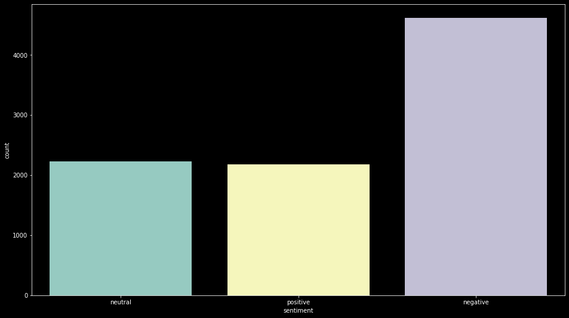
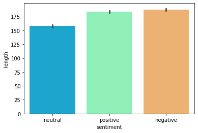
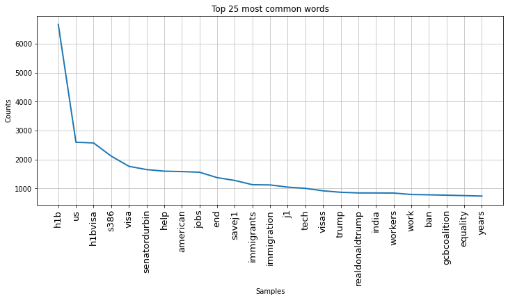
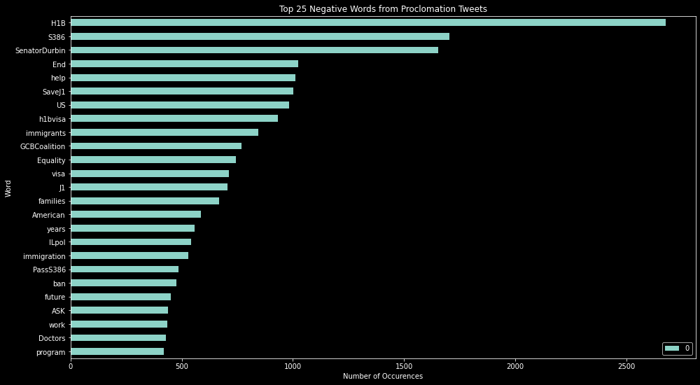
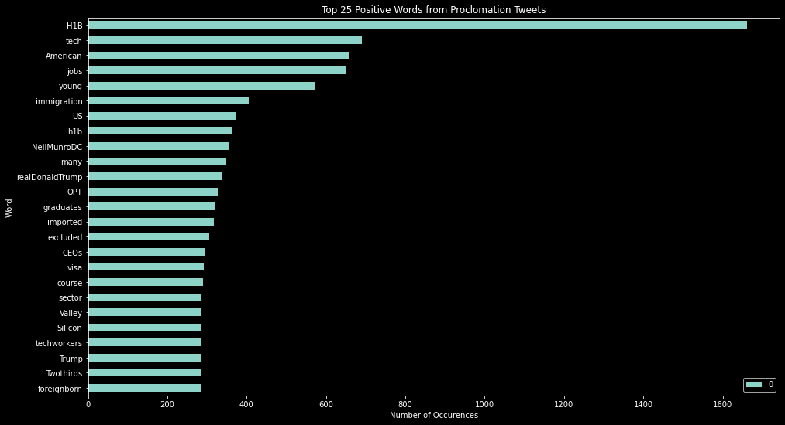

# Twitter Sentiment Analysis on

## Proclamation Suspending Entry of Aliens Who Present a Risk to the U.S. Labor Market Following the Coronavirus Outbreak
 
###  By Khulood Nasher

## Introduction
### Define the Problem
https://www.whitehouse.gov/presidential-actions/proclamation-suspending-entry-aliens-present-risk-u-s-labor-market-following-coronavirus-outbreak/

# Define The Probelm
 ## Background

On June 22, 2020, president Donald Trump issued a proclamation titled:

Proclamation Suspending Entry of Aliens Who Present a Risk to the U.S. Labor Market Following the Coronavirus Outbreak.

This proclomation has gone into effect 12:01 a.m. eastern daylight time on June 24, 2020. This proclamation suspended entry of certain new immigrants who do not already have an approved immigrant visa. It was originally valid for 60 days, until June 22, 2020.

The new proclamation extends the period for an additional 4 months, until December 31, 2020.

Section 2 of the proclamation suspends entry into the United States of any alien seeking entry pursuant to any of the following nonimmigrant visas until December 31, 2020.

Subject to section 3 of the proclamation:

H-1B or H-2B visa, and any alien accompanying or following to join such alien;

a J visa, to the extent the alien is participating in an intern, trainee, teacher, camp counselor, au pair, or summer work travel program, and any alien accompanying or following to join such alien.

an L visa, and any alien accompanying or following to join such alien.

## Main Questions:
1- What do people think about proclamation June22?

2- What aspects get the most negative mentions?

3- What aspects get the most positive mentions?

To answer those questions, I performed twitter sentiment analysis. I collected tweets during the period from June 26-July 25 2020.

Sentiments of the public were collected by tracing the following hashtags:

H2bvisa

h4visa
Lvisa

J1 Visa
h1bvisa

workvisa

I collected weekly tweets of the above hashtags using the following website: https://www.vicinitas.io/free-tools/download-search-tweets?tracker=%23+h1p+visa

Where an excel reoprt was downloaded and proccessed as acsv file. Columns of tweetId, and tweets were used for my sentiment analysis.

On my sentiment analysis, I pursed the data science approch i.e. known as: (OSEMN) which is abbreviation for :Obtain data, Scrub Data, Explore Data, Model Data , and Finally interpret Data as following:

# Methodology:

# Scrub Data
To clean the tweets:

1- cleaning from punctuation through string.punctuation.

2- cleaning from stop words through removing English Stopwords.

3- Adding extended lists of removing more unwanted words such as http,amber,rt,RT.

4- keeping important symbols such as "#" and "@"

5- Regex function was used in cleaning.

6- Applying the cleaning functions, so tweets will be tokenized as single words separated by space meaning they are tokens.

7- Joining the tokenized tweets to String, that will make them list of strings

8- convet the cleaning list of tweet strings to dataframe.
 
 
# Labeling Tweets:
1- About 9018 tweets were collected and cleaned. 

2-One third of the tweets were manually labeled. The tweet was labelled positive(1) if it supports the proclamation, negative(-1) if it refuses the proclamation, and (0) neutral if it doesn't show any feeling or stand toward the proclamation such as sharing neutral news as a source of information.

3- List of positive words and negative words were provided
 
4-  Function was defined  where  a compiler was created from the regex library which creates patterns of all positive and negative words.

5- The sentiment analyzer function was applied then on all the collected cleaned tweets and the tweets got labelled.

6- Accuracy of function was increased through comparing between unlabeled tweets to the  manual  labeled tweets  and more positive and negative words were added to the list which make the function labelelling  most tweets properly.
 
 
 # Explore Data
Generate Word Clouds for tweet classes

Generate word frequency distribution plots for tweet classes

Visualize Distribution of Tweet Length based on number of characters.

Visualize Distribution of Tweet Token Length

Visualize tweet class distribution
 
 # Negative Word Clouds

# Positive Word Clouds

# Neutral Word Clod

# Distribution of tweets in each class

# Bar plot Distribution of tweets in each class

 
 # Barplot of lenght of tweets based in number of words in each class 
 

#  The Twenty Five Most Commonwords
 
 
 # The most common 25 words in the Negative Sentiment
  

 # The most common 25 words in the Positive  Sentiment
   

# PreProcessing Data: 

Data was preprocessed as follows:

Target columns of sentiments were encoded to 0 for negative sentiment, 1 for neutral sentiment, and 2 for negative sentiment.

Tweets were tokenized, then vectorized using one of vectorizer such as TFIDF, and embedding techniques. 

# Modelling Data: 

For searching for better accuracy,Modelling Data was done in three parts.

## Part 1: TfidfVectorizer:
### Vectorization:
TF-IDF
### Classifiers:
LinearSVC, SGDClassifier,LogisticRegression,Random Forest balanced with smote and gridserch tuned, Multinomial NB, Adaboost, XGBoost, Neural Network
Train-Test Split: 60% Training, 40% Testing Evaluation: Confusion Matrix, Classification Report, Accuracy Score
 
### Train-Test Split:
60% Training, 40% Testing

### Evaluation:

Confusion Matrix, Classification Report, Accuracy Score
 
 
# Part 2: Embedding with Doc2Vec Vectorizer.
 

## Vectorization:
Doc2Vec

### Classifiers:
LinearSVC, Random Forest, Multinomial NB, Adaboost, XGBoost, Neural Network
Train-Test Split:
60% Training,40% Testing
### Evaluation:
Confusion Matrix, Classification Report, Accuracy Score
 
 
# Part 3: GloVe Word Embedding Classifiers - 100d

## Vectorization:

GloVe embeddings (100d per word, pre-trained on corpus of 2 billion tweets)

Mean embeddings are then calculated using the words present in each tweet

### Classifiers:
LinearSVC, Random Forest, Multinomial NB, Adaboost, XGBoost, Neural Network

### Train-Test Split:
60% Training, 40 % Testing
### Evaluation:
Confusion Matrix, Classification Report, Accuracy Score
 
 # NLP Vectorization Methods
Term Frequency-Inverse Document Frequency (TF-IDF) is a technique used to vectorize words in a corpus of documents. TF-IDF is based on the idea that rare words

contain more valuable information for classification than commonly occurring words in the documents. TF-IDF is the product of Term Frequency (TF) and Inverse 
Document Frequency (IDF), given by the equations below:

# Doc2Vec

Doc2Vec is an extension of the Word2Vec algorithm, and is used to create a numeric vector representation of a document, regardless of its length. Document 

embeddings are learned using the distributed memory or the distributed bag of words models.

https://radimrehurek.com/gensim/models/doc2vec.html
 
 
# GloVe

Global Vectors for Word Representation (GloVe) is an unsupervised learning algorithm for generating pre-trained vector representations for words based on co-

occurence statistics from a large corpus. For this project, the pre-trained vectors were trained on 2 billion tweets.

https://nlp.stanford.edu/projects/glove/
 
# ML Algorithms

In this study, I explored the ability of the following machine learning algorithms to accurately predict whether a tweet is positive, negative, or neutral using 

features generated by the vectorization techniques described above.

Linear Support Vector Classification (LinearSVC)

LinearSVC is a supervised algorithm that can be used for classification problems. The algorithm predicts test class labels based on decision boundaries that best 

separate the classes in n-dimensional feature space, using a linear kernel.

https://scikit-learn.org/stable/modules/generated/sklearn.svm.LinearSVC.html

### Random Forest
Random Forest is a Decision Tree-based supervised learning ensemble method. Random Forests can be used for classification or regression problems. A Random Forest includes many Decision Trees that each utilize (1) a bootstrap-sampled version of the original dataset and (2) random subsets of the dataset features. In classification problems, each of the Decision Trees in the Random Forest get a 'vote' towards the classification of each example in the test dataset. This method helps counteract the 'overfitting' that can take place when using a single Decision Tree.
https://scikit-learn.org/stable/modules/generated/sklearn.ensemble.RandomForestClassifier.html

Multinomial Naive Bayes (Multinomial NB)

### Naive Bayes classifiers perform probabilistic classification by applying Bayes' Theorem while also assuming that values for a particular feature are independent of values of the other features. Naive Bayes classifiers are commonly used as baseline algorithms for text classification.
https://scikit-learn.org/stable/modules/generated/sklearn.naive_bayes.MultinomialNB.html

### AdaBoost

AdaBoost (short for 'Adaptive Boosting') is a Decision-Tree-based supervised learning ensemble method. AdaBoost can be used for classification or regression 

problems. An AdaBoost algorithm includes many Decision Trees that are 'weak learners' (i.e., each tree has a depth of 1). Unlike a Random Forest, the trees in 

AdaBoost are trained sequentially, so that examples that were misclassified in previous trees are more heavily weighted in subsequent trees. This method also helps 

counteract the 'overfitting' that can take place when using a single Decision Tree.
https://scikit-learn.org/stable/modules/generated/sklearn.ensemble.AdaBoostClassifier.html

### XGBoost

XGBoost (short for eXtreme Gradient Boost) is an extension of the gradient boosting Decision-Tree-based ensemble method. In addition to gradient boosting, XGBoost 

allows for subsampling of the data at the row, column, and column per split levels, as well as incorporating L1 and L2 regularization.
https://xgboost.readthedocs.io/en/latest/

### Neural Network
Neural networks are a set of algorithms that can be used for supervised and unsupervised learning tasks. A neural network consists of an input layer, one or more 

hidden layers, and an output layer. Neural networks have the advantage of being able to perform 'automatic feature extraction' through the weights and activation 

functions used in the network.
https://keras.io/models/model/
 

 

