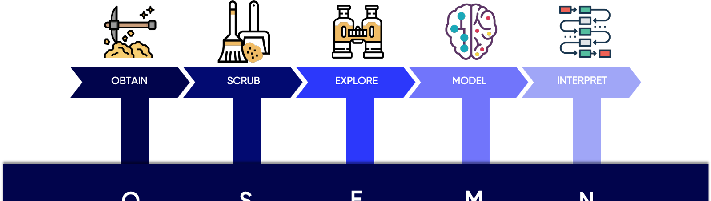
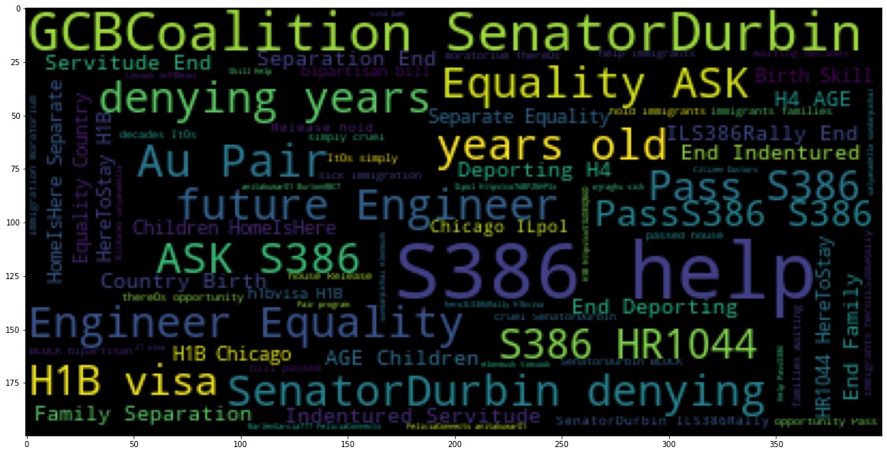
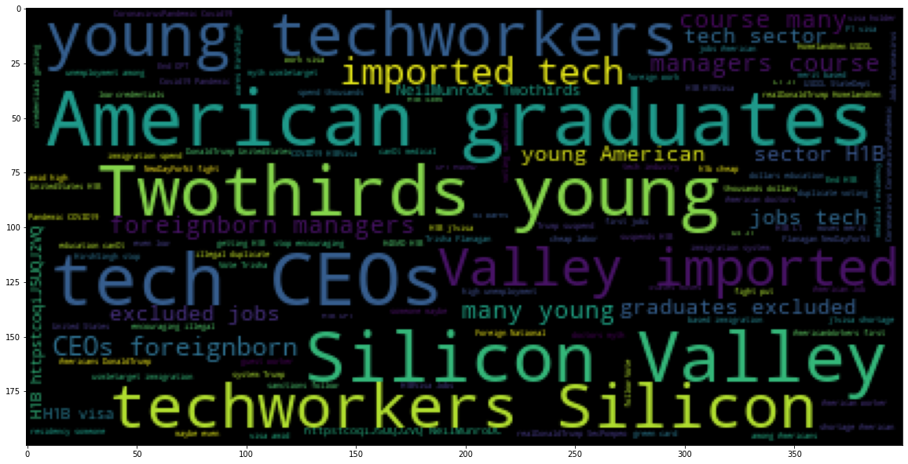
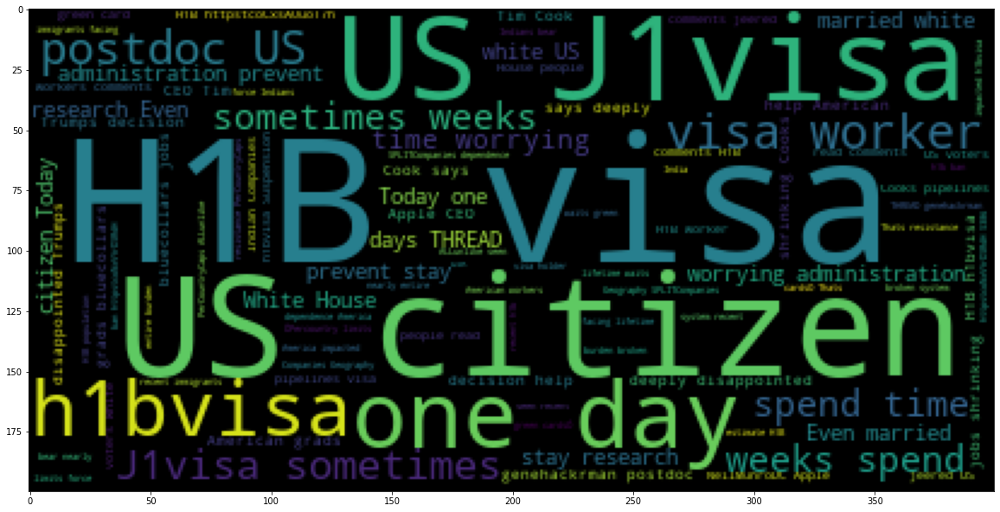
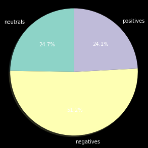

# Twitter Sentiment Analysis on

## Proclamation Suspending Entry of Aliens Who Present a Risk to the U.S. Labor Market Following the Coronavirus Outbreak
 
###  By Khulood Nasher

## Introduction
### Define the Problem
https://www.whitehouse.gov/presidential-actions/proclamation-suspending-entry-aliens-present-risk-u-s-labor-market-following-coronavirus-outbreak/

# Define The Probelm
 ## Background

On June 22, 2020, president Donald Trump issued a proclamation titled:

Proclamation Suspending Entry of Aliens Who Present a Risk to the U.S. Labor Market Following the Coronavirus Outbreak.

This proclomation has gone into effect 12:01 a.m. eastern daylight time on June 24, 2020. This proclamation suspended entry of certain new immigrants who do not already have an approved immigrant visa. It was originally valid for 60 days, until June 22, 2020.

The new proclamation extends the period for an additional 4 months, until December 31, 2020.

Section 2 of the proclamation suspends entry into the United States of any alien seeking entry pursuant to any of the following nonimmigrant visas until December 31, 2020.

Subject to section 3 of the proclamation:

H-1B or H-2B visa, and any alien accompanying or following to join such alien;

a J visa, to the extent the alien is participating in an intern, trainee, teacher, camp counselor, au pair, or summer work travel program, and any alien accompanying or following to join such alien.

an L visa, and any alien accompanying or following to join such alien.

## Main Questions:
1- What do people think about proclamation June22?

2- What aspects get the most negative mentions?

3- What aspects get the most positive mentions?

To answer those questions, I performed twitter sentiment analysis. I collected tweets during the period from June 26-July 25 2020.

Sentiments of the public were collected by tracing the following hashtags:

H2bvisa

h4visa
Lvisa

J1 Visa
h1bvisa

workvisa

I collected weekly tweets of the above hashtags using the following website: https://www.vicinitas.io/free-tools/download-search-tweets?tracker=%23+h1p+visa

Where an excel reoprt was downloaded and proccessed as acsv file. Columns of tweetId, and tweets were used for my sentiment analysis.

On my sentiment analysis, I pursed the data science approch i.e. known as: (OSEMN) which is abbreviation for :Obtain data, Scrub Data, Explore Data, Model Data , and Finally interpret Data as following:

# Methodology:

# Scrub Data
To clean the tweets:

1- cleaning from punctuation through string.punctuation.

2- cleaning from stop words through removing English Stopwords.

3- Adding extended lists of removing more unwanted words such as http,amber,rt,RT.

4- keeping important symbols such as "#" and "@"

5- Regex function was used in cleaning.

6- Applying the cleaning functions, so tweets will be tokenized as single words separated by space meaning they are tokens.

7- Joining the tokenized tweets to String, that will make them list of strings

8- convet the cleaning list of tweet strings to dataframe.
 
 
# Labeling Tweets:
1- About 9018 tweets were collected and cleaned. 

2-One third of the tweets were manually labeled. The tweet was labelled positive(1) if it supports the proclamation, negative(-1) if it refuses the proclamation, and (0) neutral if it doesn't show any feeling or stand toward the proclamation such as sharing neutral news as a source of information.

3- List of positive words and negative words were provided
 
4-  Function was defined  where  a compiler was created from the regex library which creates patterns of all positive and negative words.

5- The sentiment analyzer function was applied then on all the collected cleaned tweets and the tweets got labelled.

6- Accuracy of function was increased through comparing between unlabeled tweets to the  manual  labeled tweets  and more positive and negative words were added to the list which make the function labelelling  most tweets properly.
 
 
 # Explore Data
Generate Word Clouds for tweet classes

Generate word frequency distribution plots for tweet classes

Visualize Distribution of Tweet Length based on number of characters.

Visualize Distribution of Tweet Token Length

Visualize tweet class distribution
 
 # Negative Word Clouds

# Positive Word Clouds

# Neutral Word Clod

# Distribution of tweets in each class

 

